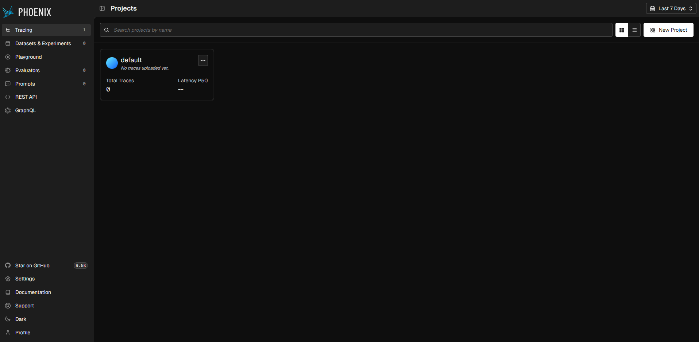

# Phoenix Playground

A hands-on learning project for [Arize Phoenix](https://phoenix.arize.com/) — an open-source observability platform for LLM applications. Each module in `src/` walks through a different Phoenix concept: tracing, agents, prompt testing, and more.

Phoenix runs fully self-hosted via Docker, so no external account is required.

---

## Prerequisites

| Tool | Purpose |
|---|---|
| Python 3.13 | Runtime |
| [Docker](https://www.docker.com/) | Runs Phoenix + Postgres locally |
| [uv](https://github.com/astral-sh/uv) | Fast Python package manager |
| [LM Studio](https://lmstudio.ai/) | Local LLM inference server |

---

## Getting Started

### 1 — Clone & install dependencies

```bash
uv pip install -r requirements.txt
# For development (includes main deps)
uv pip install -r requirements.dev.txt
```

### 2 — Configure environment

Copy the example env file and fill in your values:

```bash
cp .env.example .env
```

Key variables:

```dotenv
# LM Studio Service endpoint
LM_STUDIO_HOST=http://localhost:1234/v1
LM_STUDIO_API_KEY=not-a-real-api-key
LM_STUDIO_MODEL_ID=nvidia/nemotron-3-nano-4b

# Phoenix host and ports (collector endpoint is composed in code)
ARIZE_PHOENIX_HOST=http://localhost
ARIZE_PHOENIX_PORT=6007
ARIZE_PHOENIX_GRPC_PORT=4318
```

> The Phoenix collector endpoint (`host:port/v1/traces`) is assembled at runtime from
> `ARIZE_PHOENIX_HOST` and `ARIZE_PHOENIX_PORT` — no need to set it manually.

### 3 — Start Phoenix

```bash
docker compose up -d
```

Once running, open the Phoenix UI at **http://localhost:6007**.



---

## Playground Modules

| Module | Description | Doc |
|---|---|---|
| `src/basic_tracing` | Instrument an OpenAI client with Phoenix to capture LLM spans and visualise them in the UI | [BasicTracing.md](docs/BasicTracing.md) |
| `src/basic_agent` | Build a ReAct agent with a calculator tool; trace and chain calls so Phoenix groups them into an execution tree | [BasicAgent.md](docs/BasicAgent.md) |
| Prompt Testing | *(coming soon)* Evaluate and compare prompt variations | — |
| Datasets & Experiments | *(coming soon)* Create datasets and run experiments | — |
| Agent Evaluation | *(coming soon)* Measure quality, relevance, and correctness of LLM outputs | — |

---

## Running an Example

```bash
# Basic tracing
python src/basic_tracing/main.py

# Basic agent
python src/basic_agent/main.py
```

Check the `docs/` folder for step-by-step walkthroughs and annotated screenshots.
