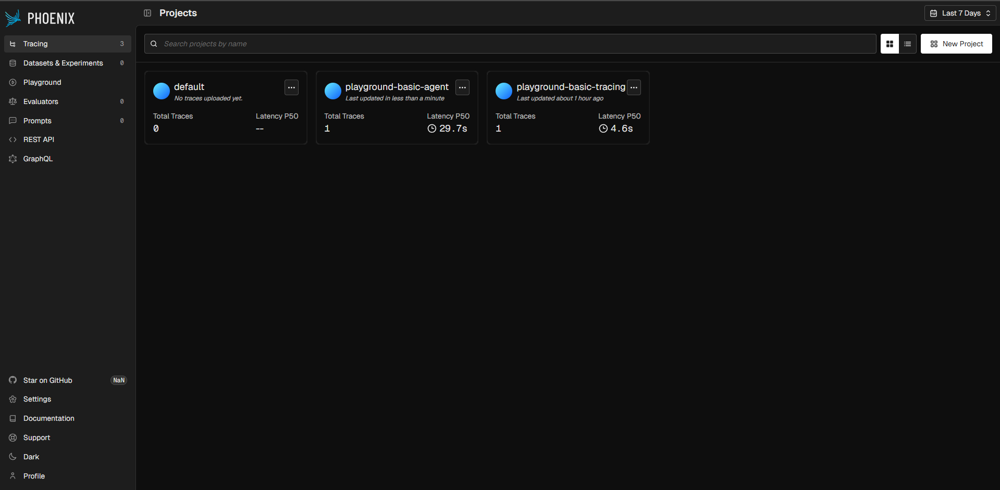
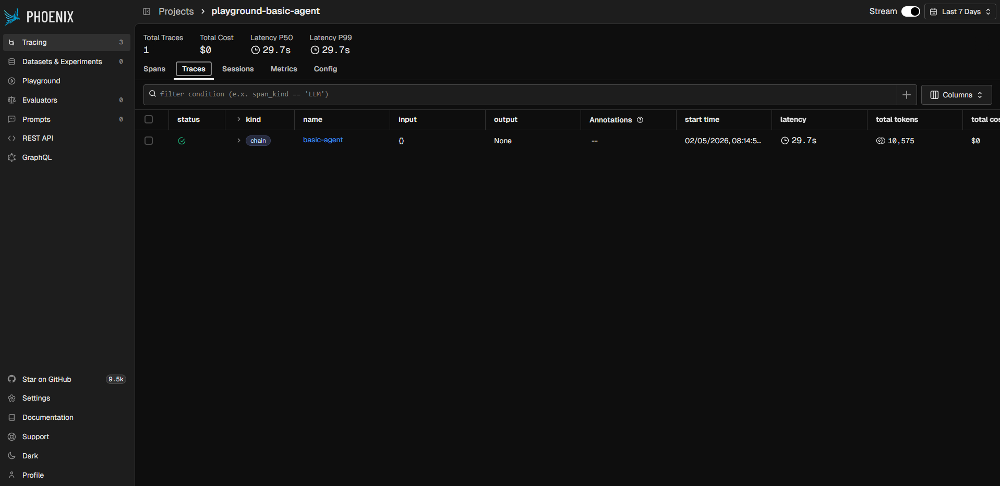
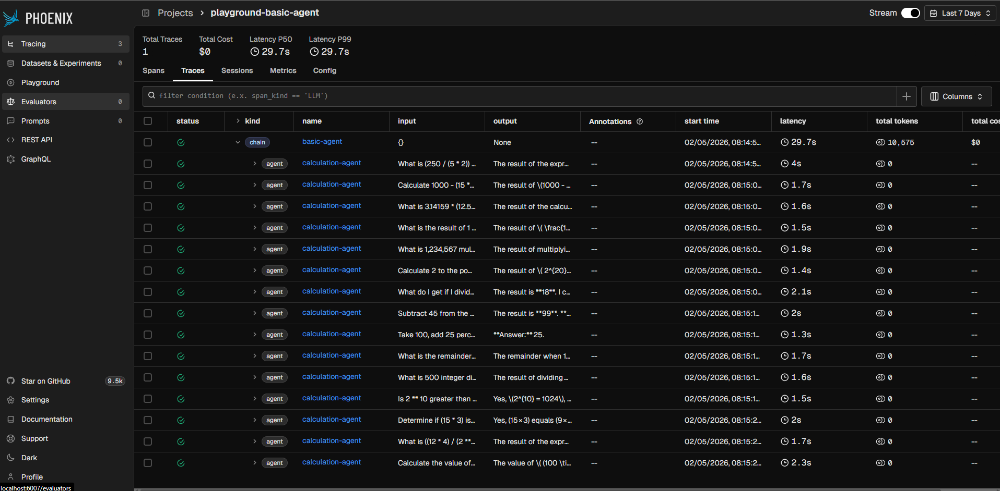
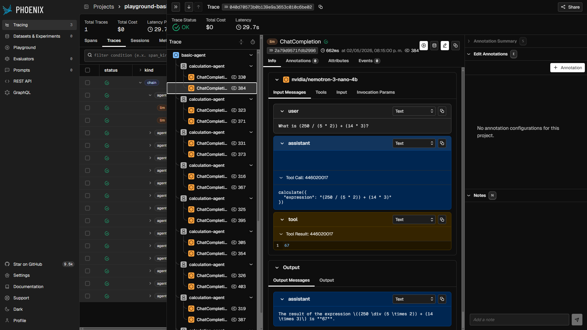

# Basic Agent

After `BasicTracing`, we will build a simple agent with one tool,
then we will trace and chain the calls for having an execution group
in the Phoenix UI. You can find this example in the `basic_agent` module.

In this example we will use more tools but is quite similar to the previous 
one, we will have a calculator tool for doing basic operations and we will
have a list of operations to run.

```python
# src/basic_agent/main.py
import os
from dotenv import load_dotenv
from langchain.agents import create_agent
from langchain_core.tools import tool
from langchain_openai import ChatOpenAI
from openinference.instrumentation.openai import OpenAIInstrumentor
from phoenix.otel import register

load_dotenv(override=True)
phoenix_host = os.getenv('ARIZE_PHOENIX_HOST')
phoenix_port = os.getenv('ARIZE_PHOENIX_PORT')
tracer_provider = register(
    project_name="playground-basic-agent",
    endpoint=f'{phoenix_host}:{phoenix_port}/v1/traces',
)
tracer = tracer_provider.get_tracer(__name__)
OpenAIInstrumentor().instrument(tracer_provider=tracer_provider)


@tool
def calculate(expression: str) -> str:
    """Calculate the result of a mathematical expression."""
    return str(eval(expression))


model = ChatOpenAI(
    base_url=os.getenv('LM_STUDIO_HOST'),
    api_key=os.getenv('LM_STUDIO_API_KEY'),
    model=os.getenv('LM_STUDIO_MODEL_ID', '')
)
agent = create_agent(model=model, tools=[calculate])
queries = [
    "What is (250 / (5 * 2)) + (14 * 3)?",
    "Calculate 1000 - (15 ** 2) / 5",
    "What is 3.14159 * (12.5 / 0.5)",
    "What is the result of 1 / 7 rounded to 4 decimal places?",
    "What is 1,234,567 multiplied by 8,910?",
    "Calculate 2 to the power of 20",
    "What do I get if I divide the square of 12 by the sum of 3 and 5?",
    "Subtract 45 from the product of 12 and 12",
    "Take 100, add 25 percent, then divide by 5",
    "What is the remainder of 145 divided by 12?",
    "What is 500 integer divided by 7?",
    "Is 2 ** 10 greater than 1000?",
    "Determine if (15 * 3) is equal to (9 * 5)",
    "What is ((12 * 4) / (2 ** 3)) + (144 ** 0.5 * 2) - 5",
    "Calculate the value of (100 * 1.05 ** 10) for compound interest"
]


@tracer.agent(name="calculation-agent")
def call_agent(query: str) -> str:
    response = agent.invoke({"messages": [("user", query)]})
    return response['messages'][-1].content


@tracer.chain(name="basic-agent")
def main():
    for query in queries:
        call_agent(query)


if __name__ == "__main__":
    main()
```

This one doesn't print individual answers — the queries are processed silently and all spans are sent to Phoenix. You will see the tracing boot output in the console:

```
OpenTelemetry Tracing Details
|  Phoenix Project: playground-basic-agent
|  Span Processor: SimpleSpanProcessor
|  Collector Endpoint: http://localhost:6007/v1/traces
|  Transport: HTTP + protobuf
|  Transport Headers: {}
|  
|  Using a default SpanProcessor. `add_span_processor` will overwrite this default.
|  
|  WARNING: It is strongly advised to use a BatchSpanProcessor in production environments.
|  
|  `register` has set this TracerProvider as the global OpenTelemetry default.
|  To disable this behavior, call `register` with `set_global_tracer_provider=False`.


Process finished with exit code 0
```

### Understanding the tracing decorators

`@tracer.agent` and `@tracer.chain` are OpenInference span decorators provided by the `OITracer` returned from `tracer_provider.get_tracer()`:

- **`@tracer.chain(name="basic-agent")`** — wraps `main()` and creates a top-level **Chain** span that groups the entire run.
- **`@tracer.agent(name="calculation-agent")`** — wraps each `call_agent()` call and creates an **Agent** child span, giving Phoenix the context to render the per-query execution tree inside the chain.

In the Phoenix UI you should see a project called `playground-basic-agent` with one Chain trace per run, each containing Agent child spans — one per query.



In this case we had many operations and queries, but we only see one chain,
in `Traces` we can click on the chain and see all the agent calls grouped inside:





Clicking in the tree, you can see how agents are part of chain, and llms are
inside of agents, each agent execution has the entire context of the agent
interaction, if you click on the llm span, you can see the prompt, response and 
all the metadata.

