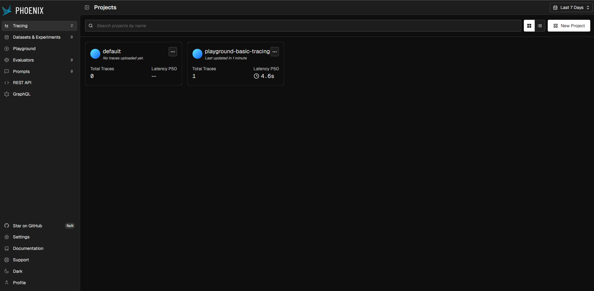
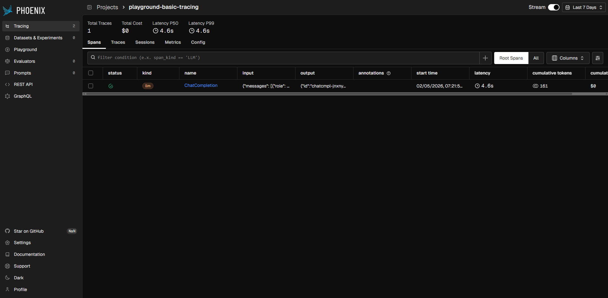
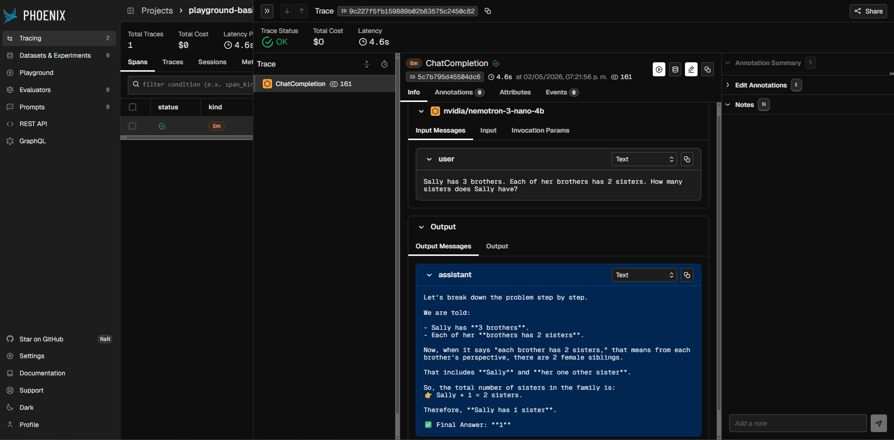

# Basic Tracing

For starting with Phoenix, the best way is to start with basic 
tracing of your LLM calls. In the `basic_tracing` module, you
can find this example.

We will need to start importing the libraries


```python 

# src/basic_tracing/main.py
import os
import openai
from dotenv import load_dotenv

load_dotenv()

client = openai.OpenAI(
    base_url=os.getenv('LM_STUDIO_HOST'),
    api_key=os.getenv('LM_STUDIO_API_KEY')
)
def main():
    response = client.chat.completions.create(
        model=os.getenv('LM_STUDIO_MODEL_ID', ''),
        messages=[{
            "role": "user",
            "content": "Sally has 3 brothers. Each of her brothers has 2 sisters. How many sisters does Sally have?"
        }]
    )
    print(response.choices[-1].message.content)
```

If we run `python src/basic_tracing/main.py` you will have an output like this:

```
Sally has **1 sister**.

Here's why:

- Sally has 3 brothers.
- Each brother has 2 sisters.

That means there are only **2 girls** in total (since each brother sees two sisters — and that must be the same set of girls for all brothers).

One of those girls is Sally, so the other girl is her sister.

Therefore, Sally has **1 sister**.

✅ Answer: **1**.

Process finished with exit code 0
```

*Note*: The output may vary based on the model that you are using, 
and the randomness of the model output. You can try running it 
multiple times to see the variations in the output.

You can notice that at this point, you're only calling the LLM,
not doing anything else, if you go to the Phoenix UI you won't see
any traces, let's modify the snippet to add the Phoenix tracing.

```python
# src/basic_tracing/main.py
import os

import openai
from dotenv import load_dotenv
from openinference.instrumentation.openai import OpenAIInstrumentor
from phoenix.otel import register

load_dotenv(override=True)
phoenix_host = os.getenv('ARIZE_PHOENIX_HOST')
phoenix_port = os.getenv('ARIZE_PHOENIX_PORT')
tracer_provider = register(
    project_name="playground-basic-tracing",
    endpoint=f'{phoenix_host}:{phoenix_port}/v1/traces',
)
OpenAIInstrumentor().instrument(tracer_provider=tracer_provider)
client = openai.OpenAI(
    base_url=os.getenv('LM_STUDIO_HOST'),
    api_key=os.getenv('LM_STUDIO_API_KEY')
)


def main():
    response = client.chat.completions.create(
        model=os.getenv('LM_STUDIO_MODEL_ID', ''),
        messages=[{
            "role": "user",
            "content": "Sally has 3 brothers. Each of her brothers has 2 sisters. How many sisters does Sally have?"
        }]
    )
    print(response.choices[-1].message.content)


if __name__ == "__main__":
    main()

```

And your output should look like this:

```
OpenTelemetry Tracing Details
|  Phoenix Project: playground-basic-tracing
|  Span Processor: SimpleSpanProcessor
|  Collector Endpoint: http://localhost:6007/v1/traces
|  Transport: HTTP + protobuf
|  Transport Headers: {}
|  
|  Using a default SpanProcessor. `add_span_processor` will overwrite this default.
|  
|  WARNING: It is strongly advised to use a BatchSpanProcessor in production environments.
|  
|  `register` has set this TracerProvider as the global OpenTelemetry default.
|  To disable this behavior, call `register` with `set_global_tracer_provider=False`.

Let's break down the problem step by step.

We are told:

- Sally has **3 brothers**.
- Each of her **brothers has 2 sisters**.

Now, when it says "each brother has 2 sisters," that means from each brother's perspective, there are 2 female siblings.

That includes **Sally** and **her one other sister**.

So, the total number of sisters in the family is:  
👉 Sally + 1 = 2 sisters.

Therefore, **Sally has 1 sister**.

✅ Final Answer: **1**

Process finished with exit code 0
``` 

Having the tracing implemented, now in the Phoenix UI, you should be able
to see that there is a new project called `playground-basic-tracing`:



And if you click on it, you should be able to see the traces of the LLM calls:



In the span list you can select the ChatCompletion span, and in the details 
you can see the input and output of the LLM call, including some additional
metadata like token consumption and latency. 

(You may need to adjust the columns to get a view like the one below)

